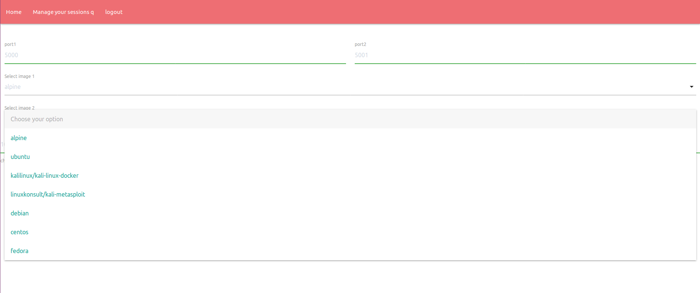
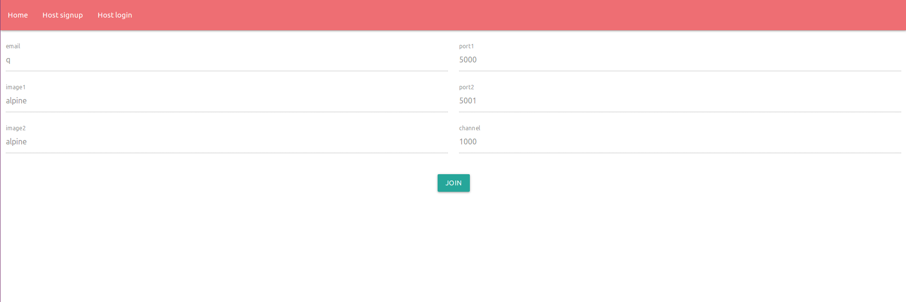
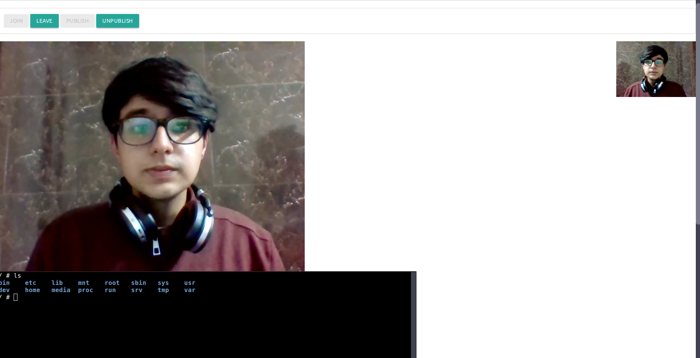
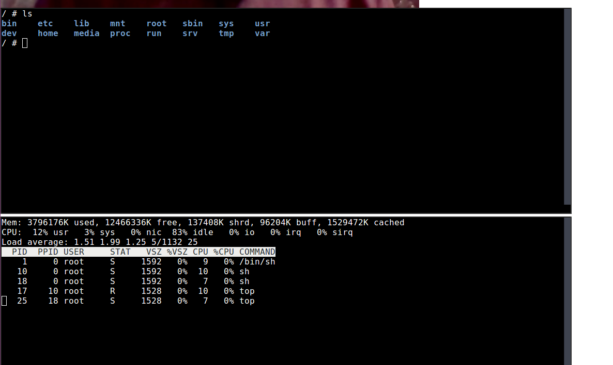
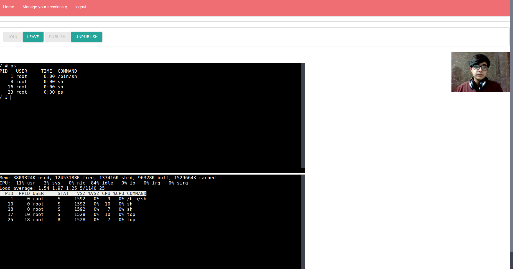
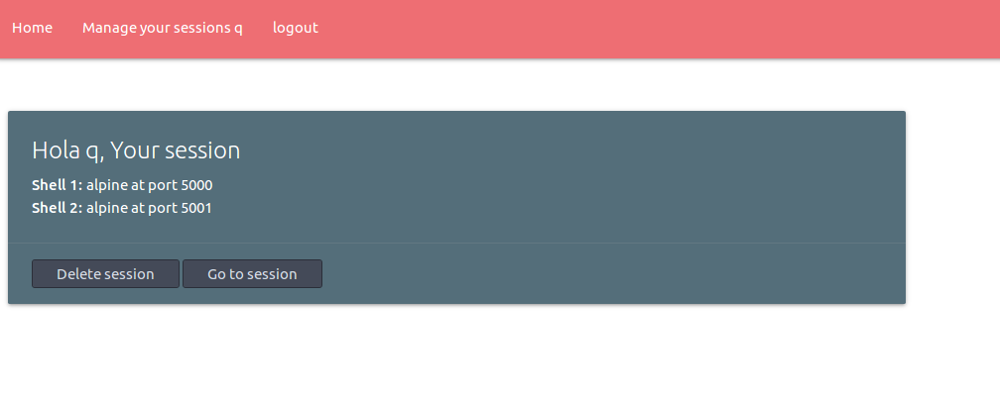

# [ARCHIVED] Examinaar

**⚠️ This project is no longer maintained and has been archived.**  
Please note that this repository is now in a read-only state and will not receive any further updates or support.

We recommend using to the latest version of the **Agora Web SDK**: [Learn more](https://www.agora.io/en/products/video-call/) 

For documentation and support, please visit the [Agora Documentation](https://docs.agora.io/en/).

---
Shared Terminal RTC. 
Multiple shared web terminals along with web RTC for CEH/Comptia+/RHCE/RHCS/LFCE/LFCS exam aid

<br />
<br />


### Steps to run

<br />

* Make sure you have [go](https://golang.org/dl/) and [docker](https://get.docker.com/) installed

<br />

* Its good to pull the following images from dockerhub before proceeding: alpine, ubuntu, debian, kalilinux, centos, fedora

<br />

* Clone the project and navigate into it

<br />

* Install go dependencies

<br />


```
chmod +x bin/*
./bin/get_dependancies
./bin/main
```

<br />
<br />


* Choose your own OS as your exam environment


* View and join active sessions


* Live video calling and monitoring


* Shared terminals between examiner and student


* Host and student abstraction


* Manage your sessions easily 


* No memory leaks, mutually exclusive sessions

<br />

<br />

<br />




<br />

<br />



<br />

<br />



<br />

<br />



<br />

<br />



<br />

<br />



<br />
